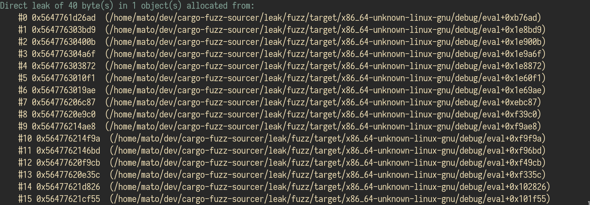
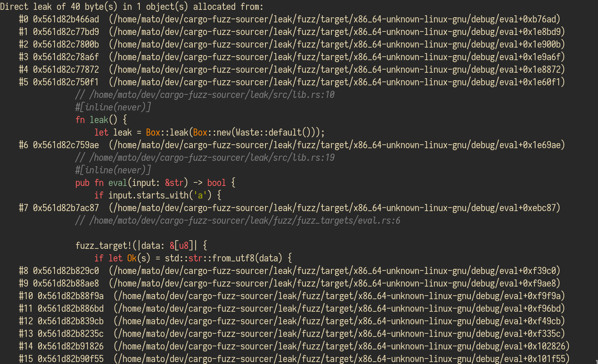

# cargo-fuzz-sourcer

Enhance [cargo-fuzz](https://github.com/rust-fuzz/cargo-fuzz) output with your
source code. Caution this is only a PoC.

## Case study

Have you ever played with `cargo-fuzz` and found a memory leak? If not, this is what it
looks like:



So, what do I do with this trace? How do I know what code triggers it? From the
offsets? Using `objdump` manually is painful way. However, you can use this tool
to help you.



The tool will parse the output of the `cargo-fuzz` and try to determine the
lines that cause memory leaks. Also, the code is highlighted using
[pygments](https://pygments.org/).

## Instructions

Installation:

```bash
git clone https://github.com/MatejKastak/cargo-fuzz-sourcer
pip install .

# Or install into virtual env
```

Usage:

```bash
cargo fuzz <your_target> --dev 2>&1 | cargo-fuzz-sourcer
```

## I want to try it

I have prepared a simple Rust library that contains a obvious memory leak. You
can fuzz it and quickly find it. The output will be annotated if you use the
following command.

```bash
cd leak
cargo fuzz run fuzz_target_1 --dev 2>&1 | cargo-fuzz-sourcer
```
